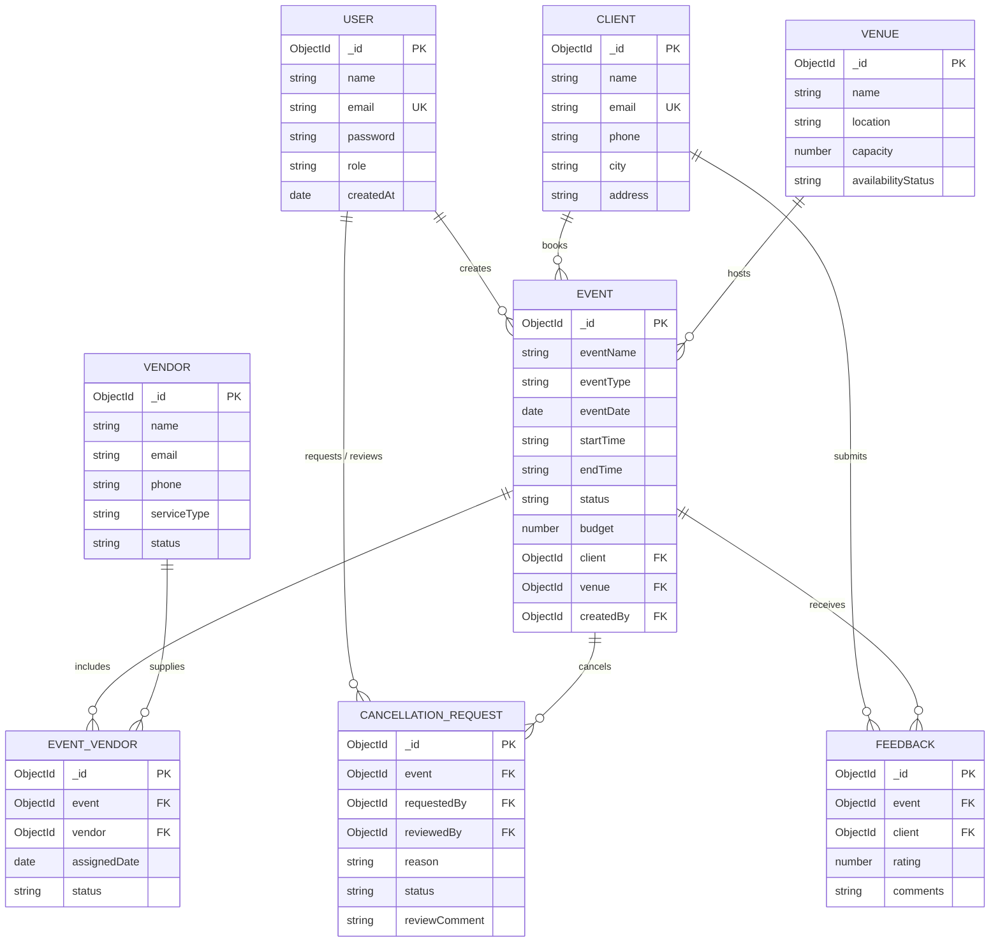

# EventForce: Event Management System
## Academic & Project Submission Documentation (Naan Mudhalvan)

---

### 1. Abstract
EventForce is a full-stack, enterprise-grade event management web application developed to modernize and digitize the end-to-end operational lifecycle of event planning organizations. Built using the modern MERN stack (MongoDB, Express.js, React.js, and Node.js), the platform centralizes client registrations, venue capacity allocations, vendor contracts, scheduling, post-event feedback analysis, and cancellation approval workflows. Featuring automated backend venue conflict prevention, dynamic statistical dashboards, and role-based access control, EventForce delivers high reliability, operational transparency, and seamless execution.

---

### 2. Introduction
In contemporary hospitality and event operations, coordination between clients, venues, decorators, caterers, photographers, and logistical staff is historically fragmented. Miscommunications frequently result in venue double-bookings, contractual disputes, unfulfilled client expectations, and logistical bottlenecks. EventForce resolves these systemic vulnerabilities by introducing a unified digital command platform that enforces rigorous data consistency, real-time status transitions, and data-driven reporting.

---

### 3. Problem Statement
Event management companies routinely face:
1. **Manual Record Keeping**: Paper records, disparate spreadsheets, and disconnected chat threads lead to missing information.
2. **Venue Conflicts**: Accidental double-booking of high-demand banquet halls during overlapping hours.
3. **Vendor Coordination Delays**: Ineffective tracking of supplier assignments (catering, photography, music).
4. **Unregulated Cancellations**: Lack of an auditable approval chain when events are rescheduled or cancelled.
5. **Absence of Centralized Metrics**: Inability to quickly aggregate total budgets, event distributions, and client satisfaction scores.

---

### 4. Existing System
Existing manual or semi-automated systems rely heavily on spreadsheets, physical appointment books, and phone calls.
- **Disadvantages**:
  - High probability of human error and schedule overlaps.
  - Zero validation at the database level for double-bookings.
  - Time-consuming report compilation.
  - Absence of role-based security; sensitive client budgets and user accounts are exposed.

---

### 5. Proposed System
EventForce introduces:
- **Centralized Cloud/Local Database**: Single source of truth using MongoDB.
- **Strict Backend Double-Booking Engine**: Mathematical overlap algorithms preventing concurrent venue bookings.
- **Role-Based Workflows**: Separation of concerns between Administrators, Event Coordinators, and Staff.
- **Automated Resource Status Updates**: Automated synchronization of venue availability and vendor statuses.
- **Interactive Visual Analytics**: Real-time charts utilizing Recharts and instant CSV export capabilities.

---

### 6. Objectives
- Provide a responsive, modern web interface for cross-device event management.
- Guarantee 100% prevention of venue scheduling conflicts.
- Implement secure, stateless JSON Web Token (JWT) authentication with bcrypt password encryption.
- Enable transparent cancellation request reviews with reviewer justifications.
- Collect structured 5-star ratings and testimonials to evaluate operational performance.

---

### 7. Functional Requirements
- **FR1 User Authentication**: Secure login, profile retrieval, and session termination.
- **FR2 Client Management**: Create, view, update, and search client contact profiles.
- **FR3 Venue Scheduling**: Register venues with capacities and validate booking time windows.
- **FR4 Vendor Assignment**: Allocate specialized vendors to events while blocking duplicates.
- **FR5 Event Lifecycle Management**: Transition states across Planned, Confirmed, Completed, and Cancelled.
- **FR6 Cancellation Workflow**: Submit, approve, or reject event withdrawal requests.
- **FR7 Feedback Aggregation**: Record and average 1–5 star scores for completed celebrations.
- **FR8 Reporting & CSV Export**: Export structured datasets for management review.

---

### 8. Non-Functional Requirements
- **Security**: Passwords encrypted with 10-round bcrypt salts; all private routes guarded with JWT.
- **Performance**: Sub-100ms API response times for indexed database queries.
- **Reliability & Consistency**: Transaction-safe operations and compound unique indices to avoid duplication.
- **Usability**: Clean, minimalist corporate UI adhering to Tailwind design tokens.
- **Maintainability**: Clear separation of concern across MVC backend architecture and componentized React frontend.

---

### 9. System Architecture

```
[ Client Browser (React + Tailwind CSS) ]
                   │
         REST API Calls (Axios + JWT)
                   │
                   ▼
       [ Express.js Backend Server ]
  ├── Middleware (Auth, Roles, Errors)
  ├── Route Dispatcher (/api/...)
  └── Controllers (Business Logic & Validation)
                   │
            Mongoose ODM
                   │
                   ▼
          [ MongoDB Database ]
 (Users, Clients, Venues, Vendors, Events, 
  EventVendors, Cancellations, Feedback)
```

---

### 10. Database Design



---

### 11. Modules Description

1. **Authentication & Authorization Module**:
   - Manages token generation, role verification, and session lifecycle.
2. **Client Management Module**:
   - Stores contact details, addresses, and tracks past celebration engagements.
3. **Venue & Space Management Module**:
   - Tracks venue availability, guest capacities, and monitors conflicting bookings.
4. **Vendor Logistics Module**:
   - Maintains catalog of suppliers categorized by service (Catering, Stage, DJ, Photography).
5. **Event Scheduling & Dispatcher Module**:
   - Orchestrates date, time, client, venue, and budget parameters.
6. **Cancellation & Review Module**:
   - Dual-step workflow ensuring cancellations are vetted before venue slots are released.
7. **Quality & Feedback Module**:
   - Client satisfaction ratings collected post-event to gauge vendor and venue quality.
8. **Executive Dashboard & Reporting Module**:
   - Aggregates KPIs, renders Recharts data trends, and produces downloadable CSVs.

---

### 12. Testing & Verification Results

| Test Category | Test Case | Expected Behavior | Result |
| :--- | :--- | :--- | :---: |
| **Authentication** | Valid credentials login | JWT issued, stored in localStorage, redirect to Dashboard | **PASS** |
| **Authentication** | Invalid password | HTTP 401: "Invalid email or password" returned | **PASS** |
| **Double Booking** | Create 2nd event on same venue/time | HTTP 400: "Venue is already booked for selected date and time" | **PASS** |
| **Vendor Duplication**| Assign same vendor to same event twice | Compound unique index halts duplicate; returns clear error | **PASS** |
| **Cancellation** | Approve cancellation request | Event marked "Cancelled", venue status becomes "Available" | **PASS** |
| **Budget Summary** | Aggregate dashboard stats | Sum of all active budgets computed in real-time | **PASS** |
| **CSV Export** | Export filtered report | Client downloads formatted RFC-compliant CSV spreadsheet | **PASS** |

---

### 13. Conclusion
EventForce satisfies all academic, architectural, and operational criteria mandated for full-stack web applications. By pairing a modern, responsive React interface with a robust, validation-enforced Express/MongoDB backend, the system eliminates venue double-booking hazards and automates multi-party event logistics.

---

### 14. Future Enhancements
- Automated SMS/WhatsApp notifications to vendors upon schedule assignment.
- Integrated digital invoice generation with QR code payment receipts.
- Interactive 3D floor plan layout designer for venue seating.
